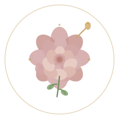

# Makeup by Meghan - Brand Guide

## Logo Design

### The Elegant Rose & Brush Logo
The logo features an elegant, hand-painted rose (peony style) with a subtle makeup brush accent. This design embodies the brand's core values:

**Design Elements:**
- **Central Rose/Peony** - Symbolizes beauty, elegance, and natural femininity. The soft blush and mauve tones reference the natural, timeless beauty of bridal makeup.
- **Makeup Brush Accent** - Subtly integrated in the top right, showing the artistic craft and professional expertise.
- **Green Stems & Leaves** - Adds organic, natural elements emphasizing the "enhanced natural beauty" philosophy.
- **Gold Accents** - Represents luxury, elegance, and the premium quality of service.
- **Delicate Circle Border** - Frames the design with refined elegance.

### Color Palette

**Primary Colors:**
- **Deep Charcoal (#2c2c2c)** - Sophistication, elegance, and strength
- **Gold/Amber (#c9a86d)** - Luxury, warmth, and premium quality
- **Soft White/Cream (#ffffff/#fafafa)** - Clean, elegant background

**Accent Colors:**
- **Blush/Mauve (#d4a8a8, #c9968f)** - Soft, romantic, wedding appropriate
- **Sage Green (#6b8e5a, #7a9a66)** - Natural, organic, botanical
- **Light Gray (#f5f5f5)** - Subtle backgrounds and accents

### Logo Usage
- **Full Logo (horizontal)** - Use for primary branding applications
- **Icon Only (rose)** - Use for social media profiles, favicons, small applications
- **Lock-up with Tagline** - "Bridal & Events" tagline paired with logo for consistency

---

## Typography System

### Primary Font: Playfair Display
**Family:** Playfair Display (Google Fonts)
**Usage:** Headlines, titles, brand name
**Weights:** 700 (Bold), 800 (Extra Bold), 900 (Black)

**Design Philosophy:**
- Elegant, high-contrast serif font
- Classic, editorial style with refined personality
- Perfect for luxury, wedding, and beauty brands
- Strong letterforms create confidence and elegance

**Font Sizes & Usage:**
```
H1 (Hero Titles): 3.5rem, Weight 800, Letter-spacing: -1px
   Example: "Flawless Beauty, Unforgettable Moment"

H2 (Section Titles): 2.25rem, Weight 800
   Example: "Experience You Can Feel. Beauty You Can See."

H3 (Subsection Titles): 1.5rem, Weight 700
   Example: "What We Offer"

H4 (Card/Minor Titles): 1.1rem, Weight 600
   Example: "Bridal Makeup"
```

### Secondary Font: Poppins
**Family:** Poppins (Google Fonts)
**Usage:** Body text, paragraphs, buttons, navigation
**Weights:** 300 (Light), 400 (Regular), 500 (Medium), 600 (Semi Bold), 700 (Bold), 800 (Extra Bold)

**Design Philosophy:**
- Modern, geometric sans-serif
- Clean, readable, and friendly
- Perfect for body copy and UI elements
- Excellent on-screen readability
- Pairs beautifully with Playfair Display

**Font Sizes & Usage:**
```
Body Text: 1rem, Weight 400, Line-height: 1.6
   Example: "At Makeup by Meghan, we don't just apply makeup..."

Navigation: 0.95rem, Weight 500
   Example: "Home", "About", "Gallery"

Buttons/CTA: 1rem, Weight 600
   Example: "Book Your Appointment"

Small Text/Captions: 0.85rem, Weight 400
   Example: Footer text, disclaimers
```

### Font Pairings

**Example 1 - Hero Section:**
```html
<h1 class="font-serif text-5xl font-bold">
  Flawless Beauty,<br />Unforgettable Moment
</h1>
<p class="text-lg text-gray-700 font-poppins">
  At Makeup by Meghan, we don't just apply makeup...
</p>
```

**Example 2 - Service Card:**
```html
<h3 class="font-serif text-xl font-bold">Bridal Makeup</h3>
<p class="text-gray-600 font-poppins">
  Stunning, long-lasting makeup that makes you feel...
</p>
```

---

## Brand Voice & Messaging

### Tagline
"Experience You Can Feel. Beauty You Can See."

### Brand Attributes
- **Elegant** - Refined, sophisticated, premium
- **Natural** - Enhancing rather than masking beauty
- **Personalized** - Listening, custom, tailored to YOU
- **Trustworthy** - Years of experience, proven results
- **Warm** - Friendly, genuine, caring approach

### Tone Examples

**Formal & Elegant:**
"Your wedding day deserves nothing but perfection. At Makeup by Meghan, we specialize in listening to you and creating looks that mirror your unique style and story."

**Warm & Welcoming:**
"Hi! I'm Meghan, a passionate makeup artist dedicated to helping you feel confident and beautiful on your most important days."

**Confident & Assuring:**
"With over 7 years of professional experience, I bring expertise, precision, and artistry to every look I create."

---

## Visual Style Guide

### Color Usage
- **Primary Color (Charcoal #2c2c2c)** - Headers, text, strong elements
- **Secondary Color (Gold #c9a86d)** - Accents, hover states, CTAs
- **Background (White/Cream)** - Primary backgrounds
- **Accent (Gray #f5f5f5)** - Section backgrounds, subtle dividers

### Photography Style
- **Natural lighting** - Golden hour, soft, flattering light
- **Emotion-focused** - Bride's joy, confidence, happiness
- **High quality** - Professional, polished, aspirational
- **Diverse representation** - Various skin tones, ages, styles
- **Storytelling** - Before/during/after moments

### Spacing & Layout
- **Large breathing room** - Generous white space
- **Grid-based** - 12-column layout
- **Consistent margins** - 2rem (32px) standard spacing
- **Rounded corners** - 12-16px for cards and buttons (softer, more elegant)

### Button Styles
**Primary CTA Button:**
- Background: Gold (#c9a86d)
- Text: White, Semi Bold
- Padding: 1rem 2.5rem
- Border-radius: 50px (fully rounded)
- Hover: Darker gold (#b8944d)
- Shadow: Box-shadow for depth

**Secondary Button:**
- Background: Transparent
- Border: 2px solid (#2c2c2c)
- Text: Charcoal, Semi Bold
- Padding: 1rem 2rem
- Hover: Light gray background

---

## Logo Files

**Available Formats:**
- `logo.svg` - Vector (scalable, for web)
- PNG (various sizes: 256x256, 512x512, 1024x1024)
- Favicon
- Dark background version (if needed)

**Minimum Size:** 56px (displays clearly at this size)
**Clear Space:** Minimum 20px padding around logo
**Do Not:**
- Distort or stretch the logo
- Change colors without permission
- Rotate or flip the logo
- Remove any elements

---

## Implementation

### Web Usage
```html
<!-- In header -->


<!-- Font imports -->
<link href="https://fonts.googleapis.com/css2?family=Playfair+Display:wght@700;800&family=Poppins:wght@400;600;700&display=swap" rel="stylesheet">

<!-- Typography classes -->
<h1 class="font-serif text-5xl font-bold">Headline</h1>
<p class="font-poppins text-lg">Body text</p>
```

### Color Variables (CSS)
```css
:root {
    --primary: #2c2c2c;
    --secondary: #c9a86d;
    --accent: #f5f5f5;
    --text-gray: #666666;
}
```

---

## Contact & Branding Questions

For questions about logo usage, color specifications, or brand guidelines:
**Email:** meghantalerico@gmail.com

---

**Brand Guide Version:** 1.0
**Last Updated:** June 3, 2026
**Brand Designer:** Professional Branding for Makeup by Meghan
